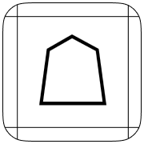

# ☖ Plain将棋盤

 

 

## 🔗 AppStore link

[apps.apple.com/app/id1620268476](https://apps.apple.com/app/id1620268476)

<!-- Manually sync below text between "📄AppDescription.swift" and "/README.md(here)" and "AppStoreConnect/_/Description". -->

## 📄 Description

駒を自由に動かせるただの将棋盤です。

iOSの標準デザインに沿ったシンプルな将棋盤アプリです。

文字のサイズや太さなどはOSシステム設定に適応して変わります。

盤面をテキストデータとして書き出したり読み込んだり出来ます。

駒を英語表記に変えられます。

任意の駒を減らすことも出来ます。

<!--==== English description ====-->

Simple Shogi board App.

You can move a piece freely.

This app based on iOS system UI design.

Character adapts font size and weight by OS option.

Output/Input function to/from plain text.

English term option.

You can reduce a piece.

==== Localization: All ====

English

Japanese(native)

 

## 🧰 Source code link

[github.com/FlipByBlink/PlainShougi](https://github.com/FlipByBlink/PlainShougi)

### Source code (Mirror) link

[gitlab.com/FlipByBlink/PlainShougi_Mirror](https://gitlab.com/FlipByBlink/PlainShougi_Mirror)

## ✉️ Contact

sear_pandora_0x@icloud.com

 

 

------

 

 

 

## Privacy Policy for AppStore

2022-04-21

### Japanese
このアプリ自身において、ユーザーの情報を一切収集しません。

### English
This application don't collect user infomation.

 

 

------

 

 

<!-- URL "Support page for AppStore" -->
<!-- https://flipbyblink.github.io/PlainShougi/ -->

<!-- URL "Privacy Policy for AppStore" -->
<!-- https://flipbyblink.github.io/PlainShougi/#privacy-policy-for-appstore -->
