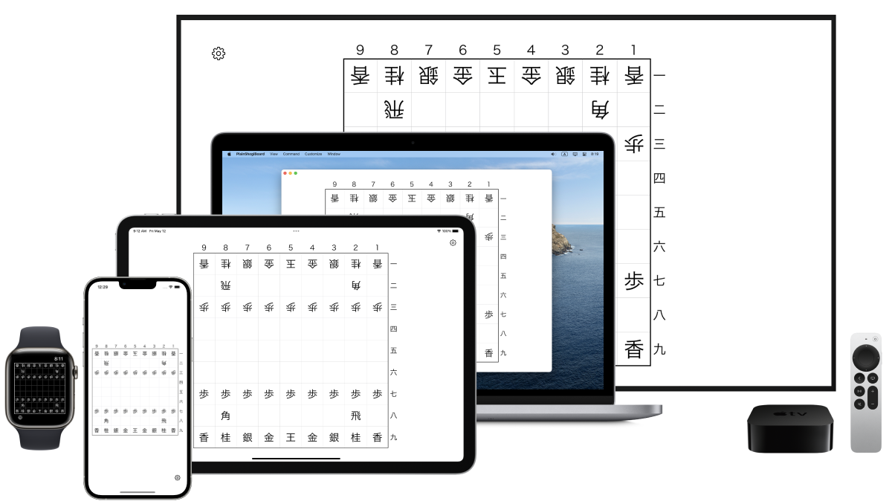
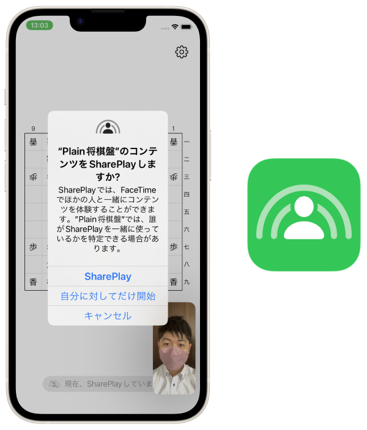

Plain将棋盤 / PlainShogiBoard
----------------------------
__iPhone, iPad, Apple Watch, Mac, Apple TV__

_どこでも。いつでも。みんなと。将棋盤。_

_Anytime. Everywhere. With friends. Shogi board._


<a href="https://apps.apple.com/app/id1620268476" target="blank">
    
</a>




概要 Description
---------------
駒を自由に動かせるただの将棋盤です。

OSの標準デザインに沿ったシンプルな将棋盤アプリです。

任意の駒を消したり増やしたりことも出来ます。

文字の「大きさ」や「太さ」、「セリフ体」などをカスタマイズ出来ます。

駒を英語表記に変えられます。

盤面をテキストデータとして書き出したり読み込んだり出来ます。

局面はiCloudによって端末間で同期されます。


Simple Shogi board.

You can move a piece freely.

This app based on OS system UI design.

You can reduce / increase pieces.

Font option: Size / Weight / Serif

English term option.

Output/Input function to/from plain text.

Sync between devices by iCloud.


### SharePlay
SharePlayに対応しています。

FaceTimeしながら友達と将棋盤を囲むことが出来ます。

SharePlay機能では「2人でシンプルに対局する」だけでなく、「大人数で詰将棋を解く」などの様々なユースケースを想定しています。


Support SharePlay.

Play shogi board with FaceTime.

Use-case: "Play game with a friend", "Discuss shogi problem with many people", etc.





### 書き出し例 Export example
```
☗
－－－－－－－－－
香͙桂͙銀͙金͙玉͙金͙銀͙桂͙香͙
　飛͙　　　　　角͙
歩͙歩͙歩͙歩͙歩͙歩͙　歩͙歩͙
　　　　　　歩͙
　　　　　　　　　
　　　　　　　　　
歩歩歩歩歩歩歩歩歩
　角　　　　　飛
香桂銀金王金銀桂香
－－－－－－－－－
☖
```


Source code link
----------------
[github.com/FlipByBlink/PlainShogi](https://github.com/FlipByBlink/PlainShogi)

### Source code (Mirror) link
[gitlab.com/FlipByBlink/PlainShogi_Mirror](https://gitlab.com/FlipByBlink/PlainShogi_Mirror)


Contact
-------
sear_pandora_0x@icloud.com


AppStore link
-------------
[apps.apple.com/app/id1620268476](https://apps.apple.com/app/id1620268476)


<br>
<br>

* * *

<br>
<br>

Privacy Policy for AppStore
----------------------------
2022-04-21

### Japanese
このアプリ自身において、ユーザーの情報を一切収集しません。

### English
This application don't collect user infomation.

<br>
<br>

* * *

<br>
<br>

<!-- URL "Support page for AppStore" -->
<!-- https://flipbyblink.github.io/PlainShogi/ -->
<!-- URL "Privacy Policy for AppStore" -->
<!-- https://flipbyblink.github.io/PlainShogi/#privacy-policy-for-appstore -->
